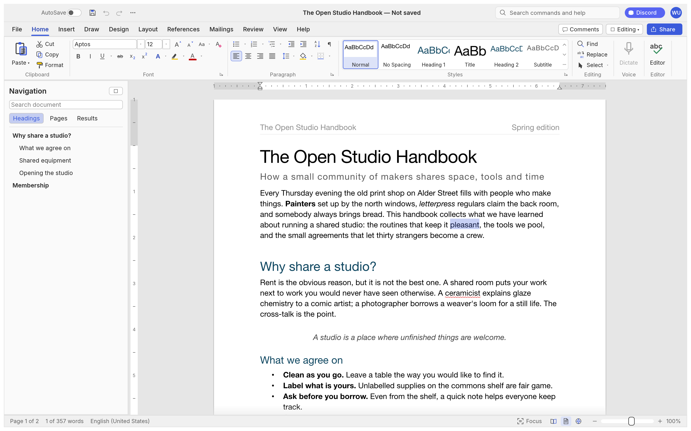
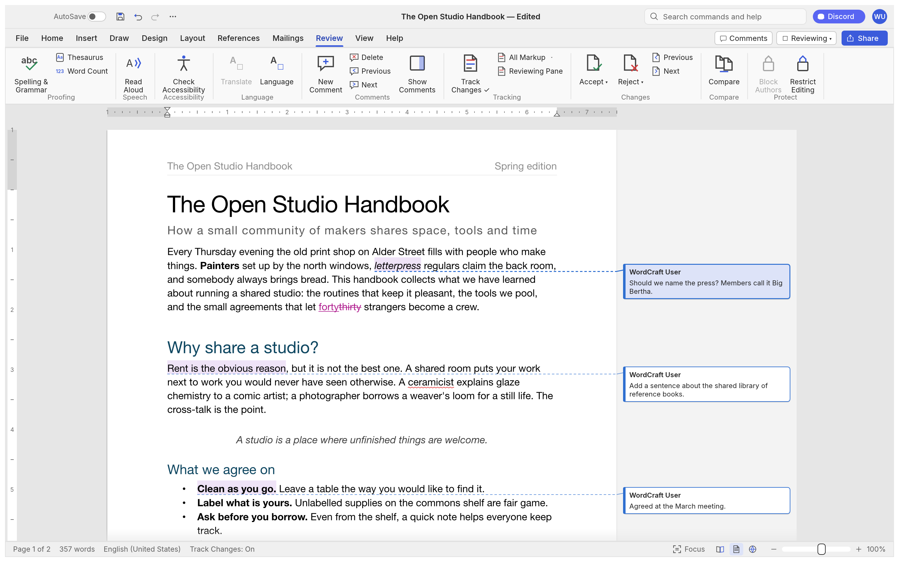
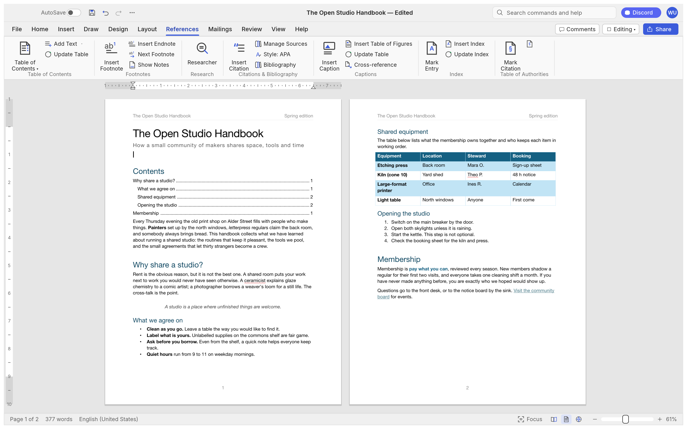
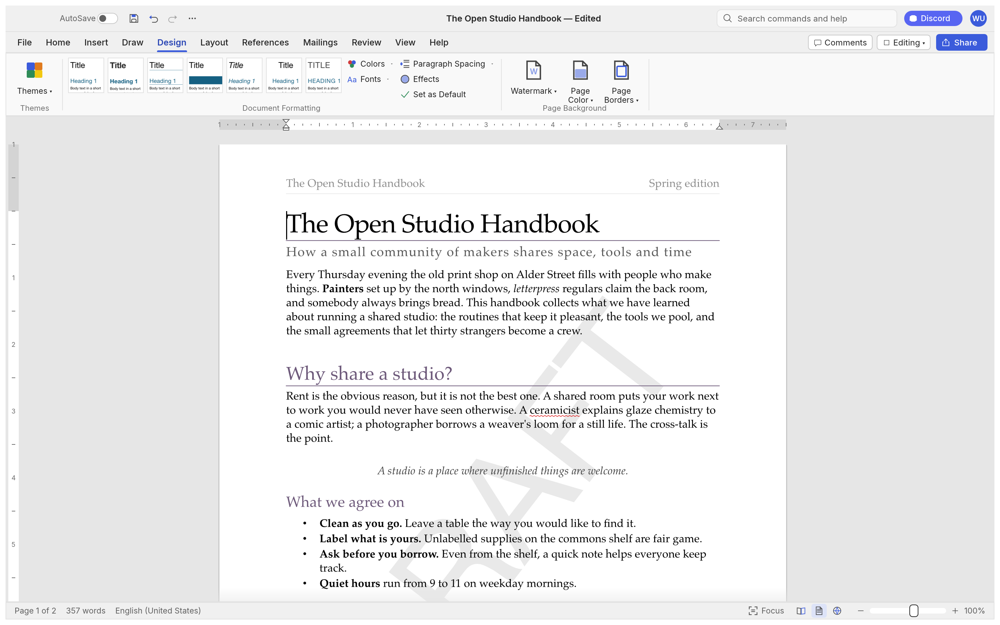
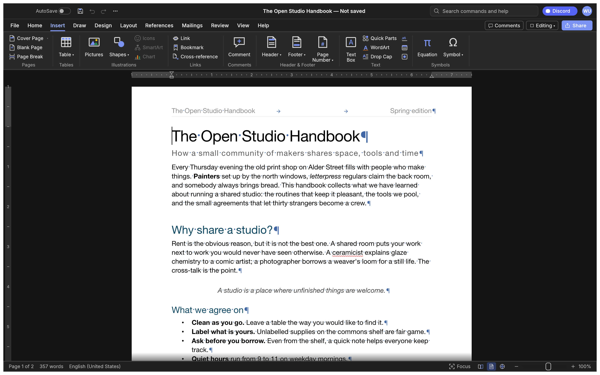
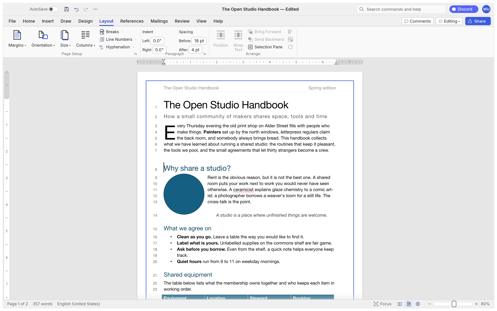
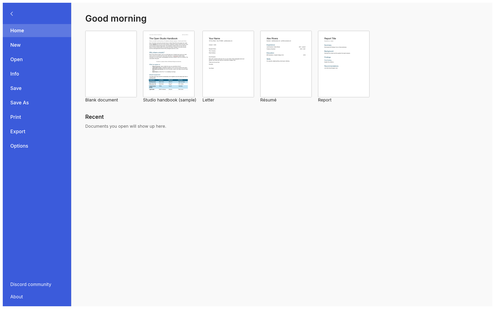

<p align="center">
  <a href="https://github.com/TalhaGoharWeb/goharscribe">
    
  </a>
</p>

<h1 align="center">GoharScribe</h1>

<p align="center">
  <b>Writing and document design; an open-source word processor rebuilt in pure Rust — with first-class Urdu/Arabic RTL support.</b>
</p>

<p align="center">
  A fast, open-source word processor with the Word workflow you already know: the ribbon, styles,
  tables, track changes, references and mail merge. It reads and writes .docx, runs natively on
  macOS, Windows, Linux and BSD, and in the browser via WebAssembly.
</p>

<p align="center">
  
  
  
  
</p>

<p align="center">
  <a href="https://github.com/TalhaGoharWeb/goharscribe"><b>GoharScribe on GitHub</b></a>
</p>

<br>

<p align="center">
  
  <br><sub><b>The Open Studio Handbook</b>, GoharScribe's built-in sample: the ribbon, live Styles gallery, rulers and the Navigation pane.</sub>
</p>

> [!NOTE]
> **GoharScribe** is a fork of [WordCraft v0.3.0](https://github.com/storytold/wordcraft) by the ArtCraft team,
> rebranded and refocused on professional Urdu/Arabic RTL writing and book creation.
> Original code is © 2026 ArtCraft Team and the WordCraft contributors (MIT OR Apache-2.0); see NOTICE.

<p align="center">
  <a href="#a-tour">A tour</a> ·
  <a href="#why-goharscribe">Why GoharScribe</a> ·
  <a href="#what-works-today">What works today</a> ·
  <a href="#quick-start">Quick start</a> ·
  <a href="#for-agents-cli-and-mcp">For agents</a> ·
  <a href="#architecture">Architecture</a> ·
  <a href="#roadmap">Roadmap</a> ·
  <a href="#downloads">Downloads</a> ·
  <a href="#license-and-credits">License and credits</a>
</p>

## A tour

Every screenshot below is GoharScribe itself, rendered offscreen by its own UI test harness
(`cargo run -p goharscribe-ui-egui --example ui_shot`).

<table>
<tr>
<td width="50%" valign="top"><p align="center"><sub><b>Review.</b> Track changes, comment balloons in the margin, accept and reject, spelling and grammar as you type.</sub></p></td>
<td width="50%" valign="top"><p align="center"><sub><b>References.</b> Tables of contents, footnotes, citations in APA, MLA, Chicago or IEEE, index and captions.</sub></p></td>
</tr>
<tr>
<td width="50%" valign="top"><p align="center"><sub><b>Design.</b> Themes, style sets, paragraph spacing, watermarks, page colour and borders.</sub></p></td>
<td width="50%" valign="top"><p align="center"><sub><b>Dark mode</b> with formatting marks, and the Insert tab: tables, pictures, shapes, links, headers, footers, fields and symbols.</sub></p></td>
</tr>
<tr>
<td colspan="2"><p align="center"><sub><b>Layout.</b> Drop caps, text wrapping around pictures and shapes, automatic hyphenation, line numbers and page borders.</sub></p></td>
</tr>
<tr>
<td colspan="2"><p align="center"><sub><b>File.</b> Start from a template, open recent documents, edit properties, export to PDF and other formats.</sub></p></td>
</tr>
</table>

## Why GoharScribe

- **Familiar.** Word's ribbon tabs, groups, shortcuts and behaviour: Enter continues a list,
  Tab demotes it, Ctrl/⌘+B bolds the word under the caret, the Styles gallery previews styles live,
  F4 repeats, F7 checks spelling, F8 extends the selection.
- **Your files.** Opens and saves .docx (OOXML), and also .odt, .rtf, .html, .md, .txt; exports PDF
  with real, selectable text, links and bookmarks.
- **Fast.** Paragraph layout is cached, so typing in a 188-page document re-lays it out in about
  1.4 ms; pages render on demand.
- **Everywhere.** One Rust codebase for macOS, Windows, Linux, BSD and the web. No Electron, no
  Tauri: native [egui](https://github.com/emilk/egui) on the GPU.
- **Built for agents.** Every action is a command with an id. The same 389 commands drive the
  ribbon, keyboard shortcuts, the command search, a command-line tool, a JSON control channel and
  an MCP server.
- **Private.** Spelling, grammar and everything else work offline.
- **Open.** MIT OR Apache-2.0. Clean-room: built from public specifications and observation, with
  every asset original or openly licensed.
- **Urdu/Arabic publishing.** Professional RTL document creation: mixed-direction BIDI layout,
  Nastaleeq/Naskh typography, RTL-aware cover pages, headers/footers with first/even page support,
  page borders, watermarks (including Urdu/Arabic presets), and DOCX round-trip fidelity.

## What works today

| Area | Highlights |
|---|---|
| **Writing** | Fast typing with IME, smart quotes, AutoCorrect, list autoformat (`* `, `1. `), dashes; word, sentence, paragraph selection; drag-select; clipboard with formatting; undo/redo; find and replace with regex |
| **Formatting** | Fonts, sizes, bold/italic/underline styles, strike, sub/superscript, caps, highlight, colours, character spacing, Format Painter, Change Case, Clear Formatting |
| **Paragraphs** | Alignment, indents (draggable on the ruler), spacing, line spacing, tabs with leaders, borders, shading, keep with next, widow/orphan control, contextual spacing, suppress hyphenation/line numbers, RTL-aware list labels |
| **Styles** | Built-in style set, live gallery, Styles pane, create/modify/update styles, style sets, themes |
| **Lists** | Bullets, numbering, multilevel, restart, set value, custom formats |
| **Tables** | Insert by grid, merge/split, styles with banded rows, borders, shading, header rows repeated across pages, rows that split across pages, sort, formulas, text ↔ table |
| **Pages** | Margins, orientation, size, columns, page/column/section breaks, headers and footers (first/even page authoring, Different First Page, Different Odd & Even), page numbers, watermarks (Urdu/Arabic presets, DOCX round-trip), page borders (7 styles), line numbers, vertical alignment, drop caps, automatic hyphenation |
| **Urdu/Arabic** | Mixed-direction BIDI visual ordering (UAX #9), Nastaleeq/Naskh font shaping with ligatures and diacritics, RTL-aware cover page templates (Studio/Classic/Minimal), explicit RTL paragraph flag, DATE/TIME field evaluation |
| **Objects** | Pictures (resize, crop, recolour, brightness/contrast, transparency, background removal, picture styles, rotate), shapes, text boxes, floating position with text wrapping (square, top and bottom, behind or in front of text) |
| **References** | Table of contents, footnotes and endnotes, citations and bibliography (APA, MLA, Chicago, IEEE), captions, table of figures, cross-references, index, table of authorities |
| **Review** | Spelling and grammar with suggestions, thesaurus, word count, comments in margin balloons or a pane, track changes, accept/reject, compare documents, restrict editing, accessibility checker, document inspector |
| **Mailings** | Mail merge from CSV, merge fields, address block, greeting line, rules, preview, finish to a document; envelopes and labels |
| **View** | Print layout, web layout, draft, read mode, focus, zoom, one/multiple pages, page width, Navigation pane, rulers, gridlines, dark mode |
| **Files** | .docx read/write (opens in Word), PDF export, .odt, .rtf, .html, .md, .txt import/export, page images |

The honest picture, area by area, is in [ROADMAP.md](ROADMAP.md) and the generated
[feature parity report](docs/parity.md).

## Quick start

```sh
git clone https://github.com/TalhaGoharWeb/goharscribe
cd goharscribe
cargo run --release -p goharscribe -- --sample        # the desktop app with the sample document
cargo run --release -p goharscribe -- report.docx     # open a document
```

Command line:

```sh
goharscribe-cli convert report.docx report.pdf        # docx, pdf, odt, rtf, html, md, txt, png
goharscribe-cli text report.docx                      # plain text
goharscribe-cli inspect report.docx                   # structure as JSON
goharscribe-cli run --template sample \
  --cmd 'select.text={"text":"Membership"}' --cmd format.bold --save out.docx
```

Web: `cd apps/goharscribe-web && trunk serve`, then open <http://127.0.0.1:8771/?sample>.

## For agents: CLI and MCP

GoharScribe was designed to be driven by people *and* by AI agents.

```sh
claude mcp add goharscribe -- goharscribe-cli mcp                  # headless documents
goharscribe --control 7981 &                                     # or drive the running app…
claude mcp add goharscribe-app -- goharscribe-cli mcp --connect 127.0.0.1:7981
```

Tools include `list_commands`, `execute`, `batch`, `type_text`, `select_text`, `inspect_document`,
`render_page`, `save_document`, and, with a running app, `screenshot`, `click` and `key`. Agents
can check their work through `inspect_document` without screenshots. See [docs/mcp.md](docs/mcp.md)
and the [control protocol](docs/control-protocol.md). Macros record any sequence of commands and
play it back (`tools.recordMacro`, `tools.macros`).

## Architecture

| Layer | Crate | Job |
|---|---|---|
| L0 | `goharscribe-geom` | units and measurements |
| L1 | `goharscribe-doc`, `goharscribe-fonts`, `goharscribe-proof` | document model and editing; fonts and shaping; spelling, grammar, hyphenation |
| L2 | `goharscribe-layout`, `goharscribe-docx`, `goharscribe-formats` | line breaking, pagination, tables, notes, hit testing; OOXML; ODT/RTF/HTML/Markdown/TXT |
| L3 | `goharscribe-render`, `goharscribe-pdf` | rasteriser (vello_cpu); PDF (krilla) |
| L4 | `goharscribe-engine` | session, undo, 389 commands, Word feature catalog |
| L5 | `goharscribe-mcp` | MCP server |
| L6 | `goharscribe-ui-egui` | the Word-style front end (swappable) |
| apps | `goharscribe`, `goharscribe-cli`, `goharscribe-web` | desktop, command line, browser |

`cargo xtask ci` runs formatting, clippy, ~250 tests, the asset-attribution check, the layering
check and the wasm build. Contributor and agent instructions: [AGENTS.md](AGENTS.md).

## Roadmap

GoharScribe covers 87% of Word's ribbon features with commands today; counting depth and
fidelity, we estimate about 62% of real feature parity. An alpha for everyday writing is close:
the remaining work is mostly testing against real-world .docx files, native printing and the
first signed builds. Charts, SmartArt, the equation editor and the Draw tab come after.
Details and estimates: [ROADMAP.md](ROADMAP.md).

## Downloads

**Download GoharScribe** from GitHub: the [latest release](https://github.com/TalhaGoharWeb/goharscribe/releases/latest) has every build listed below, and [all releases](https://github.com/TalhaGoharWeb/goharscribe/releases) has earlier versions and their notes. `<ver>` in the file names is the version number, and `SHA256SUMS.txt` lists a checksum for every file.

### Windows

| Build | Installer | Portable |
|---|---|---|
| x64 (64-bit Intel/AMD) | `goharscribe-<ver>-windows-x64.msi` | `goharscribe-<ver>-windows-x64-portable.zip` |
| arm64 (Snapdragon and other ARM PCs) | `goharscribe-<ver>-windows-arm64.msi` | `goharscribe-<ver>-windows-arm64-portable.zip` |
| x86 (32-bit) | `goharscribe-<ver>-windows-x86.msi` | `goharscribe-<ver>-windows-x86-portable.zip` |

Installers and executables are code-signed.

### macOS

| Build | File | Notes |
|---|---|---|
| App, universal (Apple silicon + Intel) | `goharscribe-<ver>-macos-universal.dmg` | Signed and notarized |
| Command-line tool, universal | `goharscribe-cli-<ver>-macos-universal.zip` | Signed and notarized |

### Linux

| Format | x86_64 | aarch64 (ARM64) | Notes |
|---|---|---|---|
| AppImage | `goharscribe-<ver>-linux-x86_64.AppImage` | `goharscribe-<ver>-linux-aarch64.AppImage` | Runs anywhere; updates itself with [AppImageUpdate](https://github.com/AppImageCommunity/AppImageUpdate) (`.zsync` files) |
| Flatpak | `goharscribe-<ver>-linux-x86_64.flatpak` | `goharscribe-<ver>-linux-aarch64.flatpak` | Sandboxed; `flatpak install --user <file>` |
| Debian/Ubuntu | `goharscribe-<ver>-linux-x86_64.deb` | `goharscribe-<ver>-linux-aarch64.deb` | |
| Fedora/RHEL/openSUSE | `goharscribe-<ver>-linux-x86_64.rpm` | `goharscribe-<ver>-linux-aarch64.rpm` | |
| Tarball | `goharscribe-<ver>-linux-x86_64.tar.gz` | `goharscribe-<ver>-linux-aarch64.tar.gz` | Unpack anywhere |

### FreeBSD

| Build | File |
|---|---|
| x86_64 | `goharscribe-<ver>-freebsd-x86_64.tar.gz` |

### Web (WebAssembly)

| Build | File | Notes |
|---|---|---|
| Static site | `goharscribe-web-<ver>.zip` | Runs in a modern browser; host it on any static server |

## Credits

GoharScribe is a fork of [WordCraft v0.3.0](https://github.com/storytold/wordcraft) (© 2026 ArtCraft Team
and the WordCraft contributors, MIT OR Apache-2.0). It is being developed into a professional
Urdu/Arabic RTL word processor and book-creation tool. See [NOTICE](NOTICE) and
[ATTRIBUTION.md](ATTRIBUTION.md) for full credits and third-party licenses.


## License and credits

GoharScribe is dual-licensed under [MIT](LICENSE-MIT) or [Apache-2.0](LICENSE-APACHE), at your option.
Copyright (c) 2026 Muhammad Talha Bin Fareed and the GoharScribe contributors; portions
copyright (c) 2026 ArtCraft Team and the WordCraft contributors (see [NOTICE](NOTICE)).

Bundled fonts, icons, images and other assets keep their own open licenses; each one is listed
with its author, source and license in [ATTRIBUTION.md](ATTRIBUTION.md).

The spelling dictionary and hyphenation come from Grady Ward's public-domain Moby Hyphenator II
word list. The sample documents and templates are original text written for GoharScribe.

<sub>Microsoft and Microsoft Word are trademarks of the Microsoft group of companies. GoharScribe is an independent, open-source project and is not affiliated with, sponsored by or endorsed by Microsoft Corporation; these names are used only to describe the workflows it is compatible with.</sub>

<p align="center">
  <a href="https://github.com/TalhaGoharWeb/goharscribe/"></a><br>
  <sub>Made by <a href="https://github.com/TalhaGoharWeb/goharscribe/">Muhammad Talha Bin Fareed</a> and contributors.</sub>
</p>
